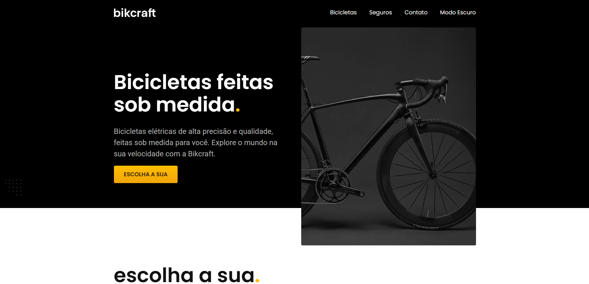

# Bikcraft - Venda de Bicicletas Elétricas

## Descrição

Bikcraft é um site de vendas de bicicletas elétricas de alta precisão e qualidade, feito sob medida para os clientes. O projeto foi desenvolvido utilizando Angular.

## Captura de Tela

Aqui está uma captura de tela da página inicial do site:

## Funcionalidades

- **Catálogo de Bicicletas:** Exibe uma lista de bicicletas elétricas disponíveis para compra, com detalhes sobre cada modelo.
- **Página de Detalhes do Produto:** Informações detalhadas sobre cada bicicleta, incluindo especificações técnicas, preço e opções de compra.
- **Formulário de Contato:** Permite que os usuários entrem em contato com a empresa para dúvidas ou pedidos especiais.
- **Modo Escuro:** Interface com suporte a modo escuro para uma melhor experiência do usuário.

## Tecnologias Utilizadas

- **Angular:** Framework principal utilizado para a construção da interface do usuário.
- **HTML5:** Marcações estruturais das páginas.
- **CSS3:** Estilização das páginas com foco em design responsivo.
- **TypeScript:** Linguagem usada no desenvolvimento das funcionalidades e lógica do projeto.

